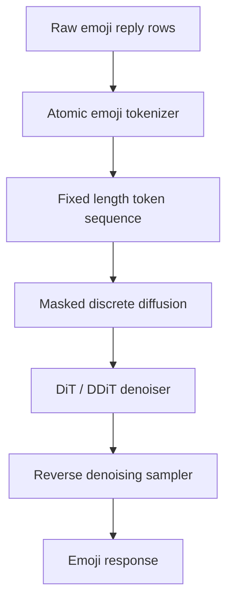
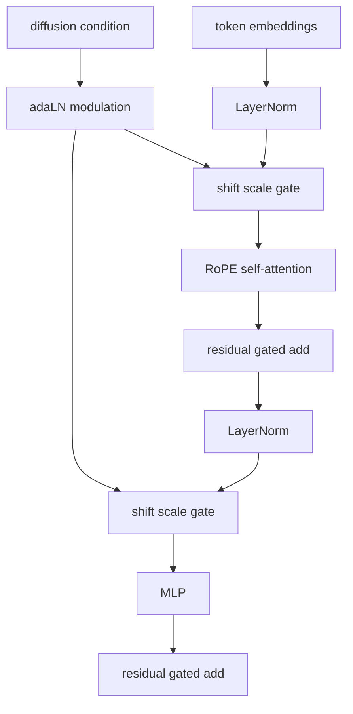
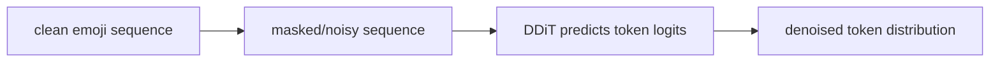
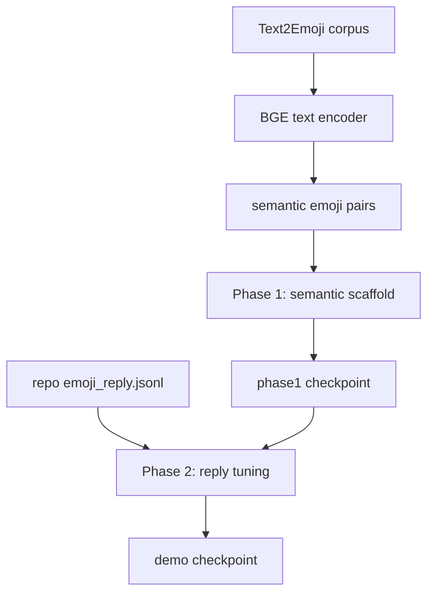

# Emoji MDLM

## Model Architecture

Specialized masked diffusion for emoji-only semantic replies

---

# One-Slide Summary

- We adapted MDLM from text to an atomic emoji vocabulary.
- The model is a Transformer denoiser inside a discrete masked diffusion process.
- Inputs are emoji-only sequences: `[BOS] prompt [SEP] response [EOS]`.
- Generation repeatedly denoises masked response tokens conditioned on the prompt.
- Training is two phase: semantic scaffold first, reply behavior second.

---

# Problem Shape

Emoji replies are short, semantic, and order-light.

Example:

```text
Prompt bag: 🎤 🎶 🌃
Target response: 🎸 🎧
```

The goal is not only next-token prediction. The useful behavior is:

- preserve emoji grapheme identity
- respond semantically
- stay stable under prompt permutation
- produce concise emoji-only output

---

# Architecture Stack



---

# Atomic Emoji Tokenizer

Instead of byte, BPE, or Unicode-codepoint tokenization:

- each emoji grapheme cluster is one token
- ZWJ sequences stay intact
- skin tones and variation selectors stay attached
- non-emoji text is filtered out for model inputs

This makes the modeling unit match the product unit.

---

# Sequence Format

Phase 1 semantic scaffold:

```text
[BOS] emoji_expr [EOS] [PAD]...
```

Phase 2 reply data:

```text
[BOS] prompt_emoji [SEP] response_emoji [EOS] [PAD]...
```

The prompt prefix is marked with `cond_mask=1`; the response side is the generation target.

---

# Concrete Demo Model

Current strongest demo checkpoint:

```text
model: medium
params: 328M
length: 64
hidden_size: 1024
blocks: 24
heads: 16
dropout: 0.1
backbone: DiT/DDiT
parameterization: SUBS
```

Checkpoint:

```text
outputs/emoji_two_phase_h100_hard1/phase2_reply/checkpoints/last.ckpt
```

---

# Denoiser: DDiT Block

Each block is a Transformer block with adaptive LayerNorm modulation.



Key detail: attention is non-causal. Diffusion denoising can use bidirectional context over the current partially masked sequence.

---

# Position and Attention

The denoiser uses:

- learned token embeddings
- rotary positional embeddings
- multi-head self-attention
- MLP expansion ratio of 4
- FlashAttention when available
- PyTorch scaled dot-product attention fallback

This is a bidirectional denoiser, not an autoregressive decoder.

---

# Diffusion Process

The model learns to reconstruct clean emoji tokens from corrupted states.



For emoji replies, this means the model can fill response tokens while the prompt prefix remains fixed.

---

# SUBS Parameterization

The repo uses `parameterization=subs`.

Practical implication:

- absorbing-state masked diffusion
- simplified objective similar to masked language modeling
- model predicts substitutions for masked/noisy tokens
- training remains compatible with standard NLL metrics

Why it matters for the demo: we get diffusion-style iterative generation without leaving the discrete emoji vocabulary.

---

# Conditional Generation

At inference:

```text
[BOS] prompt_emoji [SEP] [MASK] [MASK] [MASK] ...
```

The sampler:

1. fixes the prompt prefix
2. denoises response positions
3. stops at `[EOS]`
4. optionally clamps after 3 response tokens

The 3-token cap is a decode-time product constraint, not a separate semantic ranker.

---

# Two-Phase Training



---

# Phase 1: Semantic Scaffold

Purpose: teach broad emoji semantics before seeing the small reply dataset.

For `hard1`:

- semantic pairs: `100,000`
- top-k semantic neighbors: `5`
- steps: `1,000`
- validation NLL improved from `8.1557` to `3.7048`

The teacher encoder is only used offline to build training pairs. It is not in the deployed model.

---

# Phase 2: Reply Tuning

Purpose: teach prompt-to-response behavior.

For `hard1`:

- data: `data/emoji_reply/emoji_reply.jsonl`
- rows: `2,520`
- steps: `3,000`
- batch: `512`
- permutation augmentation: `1.0`
- benchmark rows excluded from training when configured

The reply dataset is small, so augmentation is doing real work.

---

# Permutation Augmentation

During Phase 2, prompt and response emoji order can be shuffled.

```text
🎤🎶🌃 -> 🎸🎧
🌃🎤🎶 -> 🎧🎸
🎶🌃🎤 -> 🎸🎧
```

This pushes the model toward bag-level semantic behavior instead of brittle sequence memorization.

---

# Why Diffusion Helps Here

Autoregressive decoding imposes a left-to-right response order.

Diffusion gives us:

- bidirectional response refinement
- natural masked-token objectives
- prompt conditioning without causal masking
- easier treatment of response as a small unordered semantic set

The architecture matches the task better than a generic chat completion interface.

---

# Sampler

The repo uses the MDLM sampler path:

```text
sampling.predictor = ddpm_cache
sampling.steps = 32 for eval/demo
```

For demo output:

```text
--max-response-tokens 3
```

This improves stability because emoji replies are naturally short and the model no longer tries to fill a 64-token canvas.

---

# Key Results

Repo-derived permutation eval:

| model | perm stability | target Jaccard |
| --- | ---: | ---: |
| full3 small | 0.0588 | 0.0523 |
| hard1 best | 0.1372 | 0.1290 |
| hard1 last | 0.2330 | 0.2271 |
| hard1 last, capped 3 | 0.4778 | 0.2561 |

The architecture/training changes improved the metric that matters for the demo.

---

# Frontier Comparison

OpenRouter thinking-off eval, best-of-7 benchmark score:

| model | best@7 score | best@7 Jaccard |
| --- | ---: | ---: |
| Qwen 3.7 Plus | 0.4797 | 0.3672 |
| GLM 5.2 | 0.4532 | 0.3380 |
| Gemini 3.1 Flash Lite | 0.4442 | 0.3261 |
| GPT-5.5 | 0.4385 | 0.3195 |
| Claude Opus 4.8 | 0.4334 | 0.3149 |

Gemini 3.1 Pro was excluded from the thinking-off table because OpenRouter requires reasoning for that endpoint.

---

# What The Model Is Good At

- compact emoji-only generation
- semantic adjacency
- prompt permutation robustness
- low-latency local inference compared with frontier APIs
- transparent verifier metrics

Best demo frame:

```text
Specialized small diffusion model reaches frontier-level emoji overlap
while giving us controllable order-invariant generation.
```

---

# Current Limitations

- validation NLL and permutation stability do not fully agree
- `hard1_last` is more stable but likely overfit by NLL
- reply data is small and noisy
- exact target matching remains low
- prompt-bag heldout fine-tunes collapsed semantic quality

Do not claim general emoji reasoning. Claim specialized, measured behavior.

---

# Architecture Takeaway

The win is not a bigger chat model.

It is a narrow architecture match:

```text
atomic emoji tokens
+ bidirectional masked diffusion
+ semantic scaffold pretraining
+ permutation augmentation
+ capped response decoding
= controllable emoji semantic replies
```

---

# Demo Slide

Show the same prompt bag in different orders:

```text
🎤🎶🌃 -> 🎺🥁🎧
🌃🎤🎶 -> 🎺🎷🎶
🎶🌃🎤 -> 🎸🎤🥁
```

Then show the metric:

```text
full3 stability:      0.0588
hard1 capped3:        0.4778
```

That is the cleanest architecture story.

